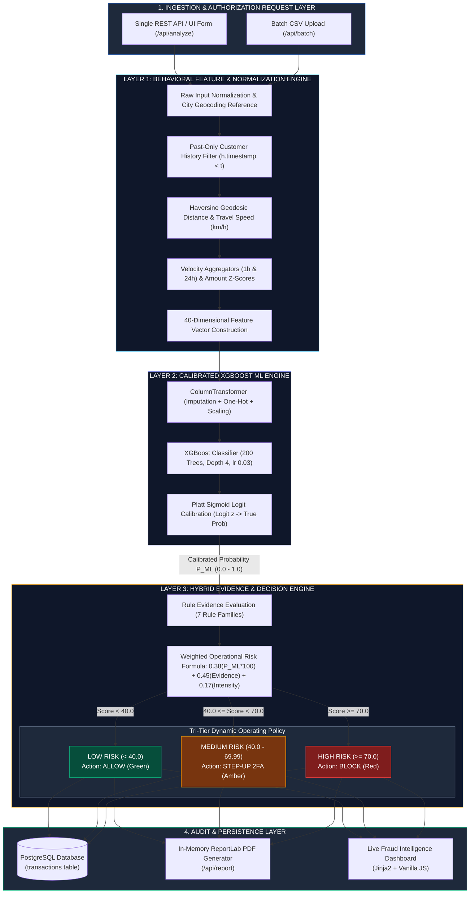

# SentinelPay — Master System Architecture Document
**Cognizant NPN AI/ML Hackathon — Complete Technical Specification**

---

## 1. Executive System Architecture

SentinelPay evaluates credit card transaction authorization requests through a **3-Layer Hybrid Intelligence Pipeline**. It synthesizes past-only customer behavioral tracking, Platt-calibrated gradient boosted decision trees (XGBoost), and an explainable rules-based evidence engine to produce real-time operational risk scores ($0.0 - 100.0$) and dynamic authorization actions (**ALLOW**, **STEP-UP 2FA**, **BLOCK**).

---

## 2. Interactive Mermaid Architecture Diagram



---

## 3. High-Resolution Text / ASCII Architecture Diagram

```text
 ┌─────────────────────────────────────────────────────────────────────────────────┐
 │               1. INGESTION & AUTHORIZATION REQUEST GATEWAY                      │
 │  - Single Real-Time REST API (/api/analyze)                                    │
 │  - Batch CSV Streaming Screener (/api/batch)                                   │
 └────────────────────────────────────────┬────────────────────────────────────────┘
                                          │ Raw Authorization Payload (13 Fields)
                                          ▼
 ┌─────────────────────────────────────────────────────────────────────────────────┐
 │             LAYER 1: PAST-ONLY BEHAVIORAL FEATURE ENGINE                        │
 │  - City Geocoding & State Reference Lookup                                      │
 │  - Past-Only History Slicing: Filter h[trans_date_trans_time] < t              │
 │  - Spatial Metrics: Haversine Geodesic Distance & Travel Speed (km/h)           │
 │  - Velocity & Amount Aggregates: Card Avg, Z-Score, 1h/24h Spend & Count         │
 └────────────────────────────────────────┬────────────────────────────────────────┘
                                          │ 40-Dimensional Feature Vector
                                          ▼
 ┌─────────────────────────────────────────────────────────────────────────────────┐
 │                   LAYER 2: CALIBRATED XGBOOST ML ENGINE                         │
 │  - Preprocessor: Scikit-Learn ColumnTransformer (One-Hot + StandardScaler)      │
 │  - Classifier: XGBoost (200 Estimators, Depth 4, Learning Rate 0.03)            │
 │  - Calibrator: Platt Sigmoid Logit Calibration (Logit z -> True Probability)     │
 └────────────────────────────────────────┬────────────────────────────────────────┘
                                          │ Calibrated Fraud Probability P_ML (0.0 to 1.0)
                                          ▼
 ┌─────────────────────────────────────────────────────────────────────────────────┐
 │               LAYER 3: HYBRID EVIDENCE & DECISION ENGINE                        │
 │  - Evidence Evaluator: 7 Rule Families (Amount, Time, Geo, Velocity, Device)    │
 │  - Operational Risk Formula:                                                    │
 │      Score = 0.38 * (P_ML * 100) + 0.45 * Evidence_Score + 0.17 * Intensity     │
 │                                                                                 │
 │  - Dynamic Tri-Tier Decision Policy:                                            │
 │      ┌─────────────────────────┬─────────────────────────┬─────────────────┐    │
 │      │  LOW RISK (0.0 – 39.99) │ MEDIUM RISK (40 – 69.9) │ HIGH RISK (70+) │    │
 │      │      ALLOW (Green)      │   STEP-UP 2FA (Amber)   │   BLOCK (Red)   │    │
 │      └─────────────────────────┴─────────────────────────┴─────────────────┘    │
 └────────────────────────────────────────┬────────────────────────────────────────┘
                                          │ Verified Risk Assessment & Decision
                                          ▼
 ┌─────────────────────────────────────────────────────────────────────────────────┐
 │                     4. AUDIT, PERSISTENCE & REPORTING LAYER                     │
 │  - PostgreSQL Database (transactions table with index on transaction_id)        │
 │  - In-Memory ReportLab PDF Generator (/api/report)                              │
 │  - Interactive Dark Fintech UI Dashboard (Jinja2 + Vanilla ES6 JS)              │
 └─────────────────────────────────────────────────────────────────────────────────┘
```

---

## 4. Layer-by-Layer Technical Specification

### Layer 1: Behavioral Feature Pipeline (`features.py`)
* **Temporal Leakage Prevention:** Enforces strict chronological filtering where historical aggregates are calculated using only records strictly preceding the current timestamp:
  $$h_{\text{valid}} = \{ \text{tx} \in \text{CardHistory} \mid \text{tx.timestamp} < t_{\text{current}} \}$$
* **Geodesic Travel Speed:** Calculates Haversine distance between customer location $(\phi_1, \lambda_1)$ and merchant location $(\phi_2, \lambda_2)$:
  $$a = \sin^2\left(\frac{\Delta\phi}{2}\right) + \cos(\phi_1)\cos(\phi_2)\sin^2\left(\frac{\Delta\lambda}{2}\right)$$
  $$d = 2 \cdot R \cdot \operatorname{atan2}(\sqrt{a}, \sqrt{1-a}), \quad R = 6371 \text{ km}$$
  $$\text{Speed (km/h)} = \frac{d}{\text{hours\_since\_previous}}$$
* **Velocity Counters:** Tracks transactions in past 1-hour and 24-hour sliding windows (`txns_last_1h`, `txns_last_24h`).

---

### Layer 2: Calibrated XGBoost ML Engine (`train_model.py` & `engine.py`)
* **Base Classifier:** XGBoost (`n_estimators=200`, `max_depth=4`, `learning_rate=0.03`, `min_child_weight=5`).
* **Platt Probability Calibration:** Converts raw tree outputs into calibrated empirical fraud probabilities using logit regression fitted on a dedicated calibration dataset split:
  $$z = \ln\left(\frac{P_{\text{raw}}}{1 - P_{\text{raw}}}\right)$$
  $$P_{\text{calibrated}} = \frac{1}{1 + e^{-(A \cdot z + B)}}$$
* **Validated Performance (Untouched Future Holdout - 15,000 Rows):**
  * **ROC-AUC:** 95.22%
  * **PR-AUC:** 74.88%
  * **False Positive Rate (FPR):** 0.95% (Bounded under $1.00\%$ policy limit)
  * **Brier Score:** 0.02285

---

### Layer 3: Hybrid Evidence & Decision Engine (`risk_engine.py`)
* **Evidence Score ($E$):** Aggregates 7 business rule anomaly families (Amount, Time, Velocity, Geo/IP, Device, Merchant, ATM):
  $$E = \min\left(\sum \text{rule\_score\_points}, 100.0\right)$$
* **Anomaly Intensity ($I_{\text{anomaly}}$):** Measures multi-signal convergence:
  $$I_{\text{anomaly}} = \min(100.0, \text{num\_triggered\_families} \times 20.0)$$
* **Operational Risk Score Formula:**
  $$\text{Operational Risk Score} = \min\left(100.0, \max\left(0.0, 0.38 \cdot (100 \cdot P_{\text{calibrated}}) + 0.45 \cdot E + 0.17 \cdot I_{\text{anomaly}}\right)\right)$$

---

### Infrastructure & Persistence Layer (`db.py` & `app.py`)
* **PostgreSQL Engine:** Stores complete transaction logs (`transactions` table) with indexing on `transaction_id` and upsert conflict resolution.
* **Audit PDF Generator:** Dynamically creates ReportLab PDF reports in memory via `/api/report`.
